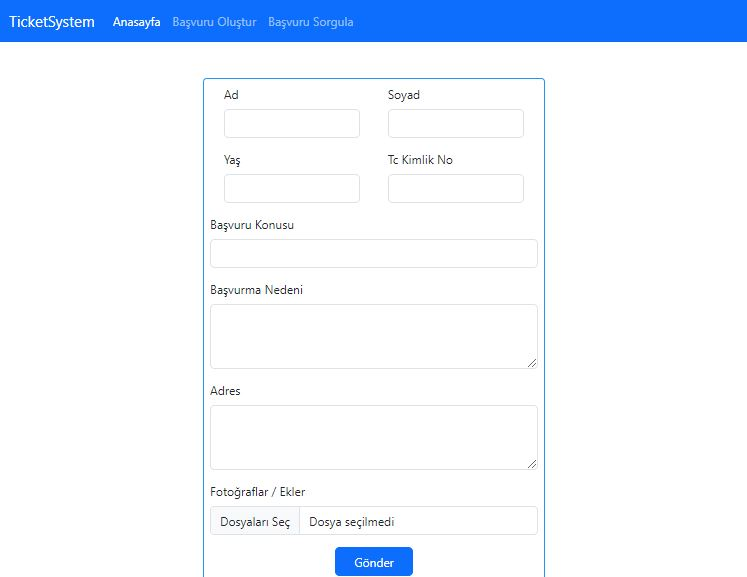
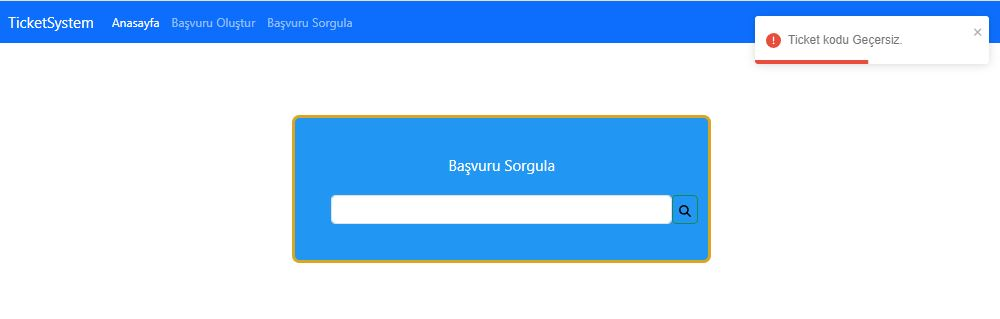
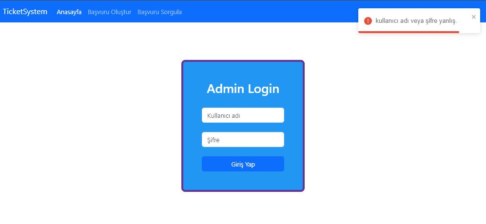
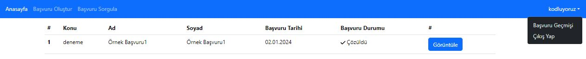
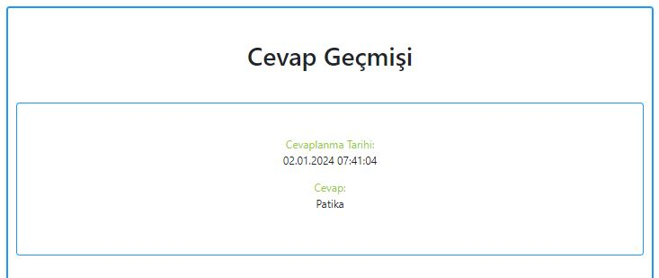

<h1>Ticket System Application</h1>

It is the final assignment of the Fimple React Bootcamp held in cooperation with Fimple and Patika.dev. The general purpose of the application is to enable users to create tickets through the interface, to ensure that those with administrative authority respond to and manage these tickets through the admin panel, to perform various update operations and to enable users to control their applications with the tracking code. along with the code given to them.

<h2>🚀 Live Version</h2>

=> https://fimple-ticket-system.vercel.app

<h3>Admin Login Information:</h3>

login link : https://fimple-ticket-system.vercel.app/admin

👤 Username: kodluyoruz 

  

🔑 Password: bootcamp109

<h2>How can you run the application?</h2>

Details of how to run the application for the backend and frontend are detailed in README.md in the Frontend React and Backend Django folders.

<h2>✅ Technologies used in the project</h2>
<h3>For Frontend:</h3>
<ul>
  <li>✔️ React</li>
  <li>✔️ ESlint</li>
  <li>✔️ Axios</li>
  <li>✔️ Bootstrap</li>
  <li>✔️ Formik</li>
  <li>✔️ prop-types</li>
  <li>✔️ React-router-dom</li>
  <li>✔️ React-toastify</li>
  <li>✔️ Yup</li>
  <li>✔️ Context API</li>
</ul>

<h3>For Backend</h3>
=> Provides API for frontend
  
<ul>
  <li>✔️ Django</li>
  <li>✔️ django-rest-framework</li>
</ul>
    

    <h2>Images</h2>
    

    
    
 
           
    

    
    

          
    

    
    

            
    

    
    
  
            
    

    
    
  
            
    

    
    
  
            

